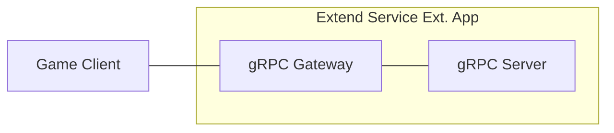
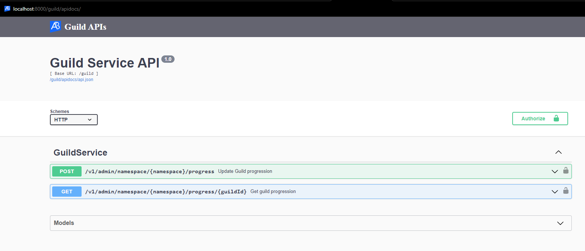
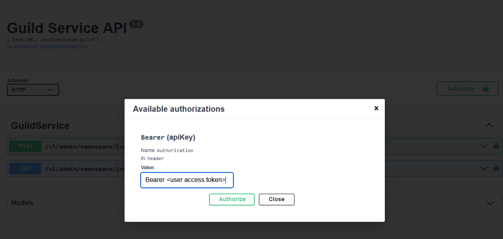

# extend-service-extension-csharp



`AccelByte Gaming Services` (AGS) capabilities can be enhanced using 
`Extend Service Extension` apps. An `Extend Service Extension` app is a RESTful 
web service created using a stack that includes a `gRPC Server` and the 
[gRPC Gateway](https://github.com/grpc-ecosystem/grpc-gateway?tab=readme-ov-file#about).

## Overview

This repository provides a project template for an `Extend Service Extension` 
app written in `C#`. It includes an example of a custom guild service which has 
two endpoints to create and get guild progress data. Additionally, it comes 
with built-in instrumentation for observability, ensuring that metrics, traces, 
and logs are available upon deployment.

You can clone this repository to begin developing your own 
`Extend Service Extension` app. Simply modify this project by defining your 
endpoints in `service.proto` file and implementing the handlers for those 
endpoints.

## Project Structure

Customizing your Extend Service Extension app involves modifying the `service.proto` and `MyService.cs` files. The app initializes key components, such as the gRPC server, in `Program.cs`. When a request is made to the RESTful endpoint, the gRPC gateway handles it and forwards it to the corresponding gRPC method. Before `myService.cs` executes any custom logic based on the request, the `authServerInterceptor.cs` first verifies that the request has the necessary access token and authorization. No other files need to be modified unless you require further customization.

```shell
.
├── src
│   ├── AccelByte.Extend.ServiceExtension.Server
│   │   ├── AccelByte.Extend.ServiceExtension.Server.csproj
│   │   ├── Classes
│   │   │   ├── AuthorizationInterceptor.cs   # gRPC server interceptor for access token authentication and authorization
│   │   │   └── ...
│   │   ├── Program.cs    # App starts here
│   │   ├── Protos
│   │   │   ├── service.proto   # gRPC server protobuf with additional options for exposing as RESTful web service
│   │   │   └── ...
│   │   ├── Services
│   │   │   └── MyService.cs    # gRPC server implementation containing the custom logic
│   └── extend-service-extension-server.sln
└── ...
```

## Prerequisites

1. Windows 11 WSL2 or Linux Ubuntu 22.04 or macOS 14+ with the following tools installed:

   a. Bash

      - On Windows WSL2 or Linux Ubuntu:

         ```
         bash --version

         GNU bash, version 5.1.16(1)-release (x86_64-pc-linux-gnu)
         ...
         ```

      - On macOS:

         ```
         bash --version

         GNU bash, version 3.2.57(1)-release (arm64-apple-darwin23)
         ...
         ```

   b. Make

      - On Windows WSL2 or Linux Ubuntu:

         To install from the Ubuntu repository, run `sudo apt update && sudo apt install make`.

         ```
         make --version

         GNU Make 4.3
         ...
         ```

      - On macOS:

         ```
         make --version

         GNU Make 3.81
         ...
         ```

   c. Docker (Docker Desktop 4.30+/Docker Engine v23.0+)
   
      - On Linux Ubuntu:

         1. To install from the Ubuntu repository, run `sudo apt update && sudo apt install docker.io docker-buildx docker-compose-v2`.
         2. Add your user to the `docker` group: `sudo usermod -aG docker $USER`.
         3. Log out and log back in to allow the changes to take effect.

      - On Windows or macOS:

         Follow Docker's documentation on installing the Docker Desktop on [Windows](https://docs.docker.com/desktop/install/windows-install/) or [macOS](https://docs.docker.com/desktop/install/mac-install/).

         ```
         docker version

         ...
         Server: Docker Desktop
            Engine:
            Version:          24.0.5
         ...
         ```

   d. .NET 6 SDK

      - On Linux Ubuntu:

         To install from the Ubuntu repository, run `sudo apt-get update && sudo apt-get install -y dotnet-sdk-6.0`.

      - On Windows or macOS:

         Follow Microsoft's documentation for installing .NET on [Windows](https://learn.microsoft.com/en-us/dotnet/core/install/windows) or on [macOS](https://learn.microsoft.com/en-us/dotnet/core/install/macos).

         ```
         dotnet --version
         
         6.0.128
         ```

   e. [Postman](https://www.postman.com/)

      - Use binary available [here](https://www.postman.com/downloads/)

   f. [extend-helper-cli](https://github.com/AccelByte/extend-helper-cli)

      - Use the available binary from [extend-helper-cli](https://github.com/AccelByte/extend-helper-cli/releases).

   > :exclamation: In macOS, you may use [Homebrew](https://brew.sh/) to easily install some of the tools above.

2. Access to AGS environment.

   a. Base URL:

      - Sample URL for AGS Shared Cloud customers: `https://spaceshooter.prod.gamingservices.accelbyte.io`
      - Sample URL for AGS Private Cloud customers:  `https://dev.accelbyte.io`

   b. [Create a Game Namespace](https://docs.accelbyte.io/gaming-services/services/access/reference/namespaces/manage-your-namespaces/) if you don't have one yet. Keep the `Namespace ID`. Make sure this namespace is in active status.

   c. [Create an OAuth Client](https://docs.accelbyte.io/gaming-services/services/access/authorization/manage-access-control-for-applications/#create-an-iam-client) 
      with confidential client type with the following permissions. Keep the 
      `Client ID` and `Client Secret`.

      - For AGS Private Cloud customers:
         - `ADMIN:ROLE [READ]` to validate access token and permissions
         - `ADMIN:NAMESPACE:{namespace}:NAMESPACE [READ]` to validate access namespace
         - `ADMIN:NAMESPACE:{namespace}:CLOUDSAVE:RECORD [CREATE,READ,UPDATE,DELETE]` to create, read, update, and delete cloudsave records         
      - For AGS Shared Cloud customers:
         - IAM -> Roles (Read)
         - Basic -> Namespace (Read)
         - Cloud Save -> Game Records (Create, Read, Update, Delete)

## Setup

To be able to run this app, you will need to follow these setup steps.

1. Create a docker compose `.env` file by copying the content of 
   [.env.template](.env.template) file.

   > :warning: **The host OS environment variables have higher precedence 
   compared to `.env` file variables**: If the variables in `.env` file do not 
   seem to take effect properly, check if there are host OS environment 
   variables with the same name. See documentation about 
   [docker compose environment variables precedence](https://docs.docker.com/compose/how-tos/environment-variables/envvars-precedence/) 
   for more details.

2. Fill in the required environment variables in `.env` file as shown below.

   ```
   AB_BASE_URL='http://test.accelbyte.io'    # Your environment's domain Base URL
   AB_CLIENT_ID='xxxxxxxxxx'                 # Client ID from the Prerequisites section
   AB_CLIENT_SECRET='xxxxxxxxxx'             # Client Secret from the Prerequisites section
   AB_NAMESPACE='xxxxxxxxxx'                 # Namespace ID from the Prerequisites section
   PLUGIN_GRPC_SERVER_AUTH_ENABLED=true      # Enable or disable access token and permission validation
   BASE_PATH='/guild'                        # The base path used for the app
   ```
 
   > :exclamation: **In this app, PLUGIN_GRPC_SERVER_AUTH_ENABLED is `true` by default**: If it is set to `false`, the endpoint `permission.action` and `permission.resource`  validation will be disabled and the endpoint can be accessed without a valid access token. This option is provided for development purpose only.
   
   For more options, create 
   `src/AccelByte.PluginArch.ServiceExtension.Demo.Server/appsettings.Development.json` 
   and fill in the required configuration.

   ```json
   {
      "EnableAuthorization": true,                    // Enable or disable access token and permission check (env var: PLUGIN_GRPC_SERVER_AUTH_ENABLED)
      "RevocationListRefreshPeriod": 60,
      "AccelByte": {
         "BaseUrl": "http://test.accelbyte.io",       // Your environment's domain Base URL (env var: AB_BASE_URL)
         "ClientId": "xxxxxxxxxx",                    // Client ID (env var: AB_CLIENT_ID)    
         "ClientSecret": "xxxxxxxxxx",                // Client Secret (env var: AB_CLIENT_SECRET)
         "AppName": "EXTENDSERVICEEXTENSIONSERVICE",
         "TraceIdVersion": "1",
         "Namespace": "xxxxxxxxxx",                   // Namespace ID (env var: AB_NAMESPACE)
         "EnableTraceId": true,
         "EnableUserAgentInfo": true,
         "ResourceName": "EXTENDSERVICEEXTENSIONSERVICE"
      }
   }
   ```
   > :warning: **Environment variable values will override related configuration values in this file**.

## Building

To build this app, use the following command.

```shell
make build
```

The build output will be available in `.output` directory.

## Running

To (build and) run this app in a container, use the following command.

```shell
docker compose up --build
```

## Testing

### Unit Test

The unit test for the example included in this project is available in `src/AccelByte.Extend.ServiceExtension.Server.Tests`. To run the test, you'll need to fill the env var file mentioned below,
```
AB_BASE_URL='http://test.accelbyte.io'       # Your environment's domain Base URL
AB_CLIENT_ID='xxxxxxxxxx'                    # Client ID from the Prerequisites section
AB_CLIENT_SECRET='xxxxxxxxxx'                # Client Secret from the Prerequisites section
AB_NAMESPACE='xxxxxxxxxx'                    # Namespace ID from the Prerequisites section
```

Then run this command.

```shell
make test_with_env ENV_FILE_PATH=<your env var file>
```

### Test in Local Development Environment

This app can be tested locally through the Swagger UI.

1. Run this app by using the command below.

   ```shell
   docker compose up --build
   ```

2. If **PLUGIN_GRPC_SERVER_AUTH_ENABLED** is `true`: Get an access token to 
   be able to access the REST API service. 
   
   To get an access token, you can use [demo/get-access-token.postman_collection.json](get-access-token.postman_collection.json) in demo folder.
   Import the Postman collection to your Postman workspace and create a 
   Postman environment containing the following variables.

   - `AB_BASE_URL` For example, https://test.accelbyte.io
   - `AB_CLIENT_ID` A confidential IAM OAuth client ID
   - `AB_CLIENT_SECRET` The corresponding confidential IAM OAuth client secret
   - `AB_USERNAME` The username or e-mail of the user (for user token)
   - `AB_PASSWORD` The corresponding user password (for user token)

   Inside the postman collection, use `get-client-access-token` request to get client token or use `get-user-access-token` request to get user access token.

   > :info: When using client access token, make sure the IAM client has following permission: 
   `ADMIN:NAMESPACE:{namespace}:CLOUDSAVE:RECORD [CREATE,READ,UPDATE,DELETE]`.
   
   > :info: When using user access token, make sure the user has a role which contains following permission:
   `ADMIN:NAMESPACE:{namespace}:CLOUDSAVE:RECORD [CREATE,READ,UPDATE,DELETE]`.

3. The REST API service can then be tested by opening Swagger UI at 
   `http://localhost:8000/guild/apidocs/`. Use this to create an API request 
   to try the endpoints.
   
   > :info: Depending on the envar you set for `BASE_PATH`, the service will 
   have different service URL. This how it's the formatted 
   `http://localhost:8000/<base_path>`

   

   To authorize Swagger UI, click on "Authorize" button on right side.

   

   Popup will show, input "Bearer <user access token>" in `Value` field for 
   `Bearer (apiKey)`. Then click "Authorize" to save the user's access token.

### Test Observability

To be able to see the how the observability works in this template project in
local development environment, there are few things that need be setup before 
performing test.

1. Uncomment loki logging driver in [docker-compose.yaml](docker-compose.yaml)

   ```
    # logging:
    #   driver: loki
    #   options:
    #     loki-url: http://host.docker.internal:3100/loki/api/v1/push
    #     mode: non-blocking
    #     max-buffer-size: 4m
    #     loki-retries: "3"
   ```

   > :warning: **Make sure to install docker loki plugin beforehand**: Otherwise,
   this app will not be able to run. This is required so that container 
   logs can flow to the `loki` service within `grpc-plugin-dependencies` stack. 
   Use this command to install docker loki plugin: 
   `docker plugin install grafana/loki-docker-driver:latest --alias loki --grant-all-permissions`.

2. Clone and run [grpc-plugin-dependencies](https://github.com/AccelByte/grpc-plugin-dependencies) stack alongside this app. After this, Grafana 
will be accessible at http://localhost:3000.

   ```
   git clone https://github.com/AccelByte/grpc-plugin-dependencies.git
   cd grpc-plugin-dependencies
   docker compose up
   ```

   > :exclamation: More information about [grpc-plugin-dependencies](https://github.com/AccelByte/grpc-plugin-dependencies) 
   is available [here](https://github.com/AccelByte/grpc-plugin-dependencies/blob/main/README.md).

3. Perform testing. For example, by following [Test in Local Development Environment](#test-in-local-development-environment).

## Deploying

To deploy this app to AGS, follow the steps below.

1. [Create a new Extend Service Extension App on Admin Portal](https://docs.accelbyte.io/gaming-services/services/extend/service-extension/getting-started-service-extension/#register-and-integrate-custom-service-to-extend-service-extension). 
   Keep the `Repository URI`.

2. Download and setup [extend-helper-cli](https://github.com/AccelByte/extend-helper-cli/) 
   (only if it has not been done previously).

3. Perform docker login with `extend-helper-cli` using the following command.

   ```
   extend-helper-cli dockerlogin --namespace <my-game> --app <my-app> --login
   ```

   > :exclamation: For your convenience, the above `extend-helper-cli` command 
   can also be copied from `Repository Authentication Command` under the 
   corresponding app detail page.

4. Build and push this app docker image to AccelByte ECR using the following command.
   
   ```
   extend-helper-cli image-upload --work-dir <my-project-dir> --namespace <my-game> --app <my-app> --image-tag v0.0.1
   ```

   > :warning: Make sure to perform docker login (step 3) before executing the above command.

5. Open Admin Portal, go to **Extend** -> **Service Extension**. And then select the extend app.

6. To deploy selected image tag, click **Image Version History** and select 
   desired image tag to be deployed.

7. Click **Deploy Image**, confirm the deployment and go back to App Detail by 
   clicking **Cancel**.

8. Wait until app status is running.

For more information on how to deploy an `Extend Service Extension` app, see 
[here](https://docs.accelbyte.io/gaming-services/services/extend/service-extension/getting-started-service-extension/#build-and-upload-the-extend-app).

## Next Step

Proceed to create your own `Extend Service Extension` app by modifying this project. See [here](https://docs.accelbyte.io/gaming-services/services/extend/service-extension/customize-service-extension-app/) for more details.
