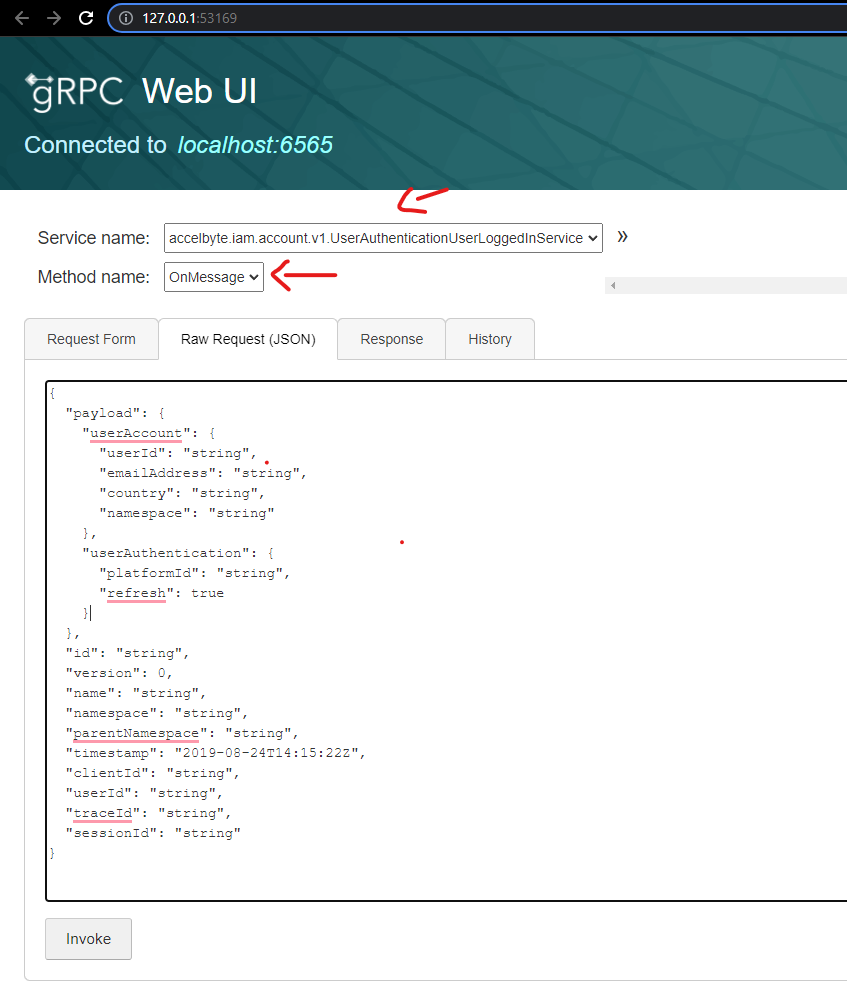

# extend-service-extension-csharp

## Overview

This repository contains a `sample service extension app` written in `C#`.
It provides a simple custom guild service that has 2 (two) endpoints to create and get guild progress data.
This sample app provides a grpc server in .NET and a [grpc-gateway](https://github.com/grpc-ecosystem/grpc-gateway) implementation for the grpc server in GoLang.

This sample app also shows how this `gRPC server` can be instrumented for better observability.
It is configured by default to send metrics, traces, and logs to the observability `dependency services` 
in [grpc-plugin-dependencies](https://github.com/AccelByte/grpc-plugin-dependencies).

> :warning: **grpc-plugin-dependencies is provided as example for local development purpose only:** The dependency services in the actual gRPC server deployment may not be exactly the same.


## Prerequisites

1. Windows 10 WSL2 or Linux Ubuntu 20.04 with the following tools installed.

   a. bash

   b. make

   c. docker v23.x

   d. docker-compose v2

   e. .net 6 sdk

   f. docker loki driver (required for docker log with loki)
    
      ```
      docker plugin install grafana/loki-docker-driver:latest --alias loki --grant-all-permissions
      ```
   g. go v1.20 (optional, generate grpc-gateway action in Makefile use docker image to compile go)

   h. [ngrok](https://ngrok.com/)

   i. [postman](https://www.postman.com/)

   j. [grpcurl](https://github.com/fullstorydev/grpcurl)

3. Access to `AccelByte Gaming Services` demo environment.

   a. Base URL: https://demo.accelbyte.io.
   
   b. [Create a Game Namespace](https://docs.accelbyte.io/esg/uam/namespaces.html#tutorials) 
      if you don't have one yet. Keep the `Namespace ID`.
   
   c. [Create an OAuth Client](https://docs.accelbyte.io/guides/access/iam-client.html) with `confidential` client type. Keep the `Client ID` and `Client Secret`.
      ```
      ADMIN:ROLE [READ]
      ADMIN:NAMESPACE:{namespace}:CLOUDSAVE:RECORD [CREATE,READ,UPDATE,DELETE]
      ```

4. [Extend Helper CLI](https://github.com/AccelByte/extend-helper-cli) to upload the app to AGS. Note that to use the tool you'll need an AGS account, be sure to follow the docs on the github link above.

## Setup

To be able to run this sample app, you will need to follow these setup steps.

1. Create a docker compose `.env` file by copying the content of [.env.template](.env.template) file.

   > :warning: **The host OS environment variables have higher precedence compared to `.env` file variables**: If the variables in `.env` file do not seem to take effect properly, check if there are host OS environment variables with the same name. 
   See documentation about [docker compose environment variables precedence](https://docs.docker.com/compose/environment-variables/envvars-precedence/) for more details.

2. Fill in the required environment variables in `.env` file as shown below.

   ```
   AB_BASE_URL=https://demo.accelbyte.io     # Base URL of AccelByte Gaming Services demo environment
   AB_CLIENT_ID='xxxxxxxxxx'                 # Client ID from the Prerequisites section
   AB_CLIENT_SECRET='xxxxxxxxxx'             # Client Secret from the Prerequisites section
   AB_NAMESPACE='xxxxxxxxxx'                 # Namespace ID from the Prerequisites section
   PLUGIN_GRPC_SERVER_AUTH_ENABLED=true     # Enable or disable access token and permission verification
   ```
     > :info: **PLUGIN_GRPC_SERVER_AUTH_ENABLED**: If 'disable' will bypass the validation being set on the endpoint `permission.action` and `permission.resource` [creating-new-endpoint](6-creating-new-endpoint.md#6-creating-a-new-endpoint)

   For more options, create `src/AccelByte.PluginArch.ServiceExtension.Demo.Server/appsettings.Development.json` and fill in the required configuration.   
   ```json
   {
   "DirectLogToLoki": false,
   "EnableAuthorization": false,                 // Enable or disable access token and permission check (env var: PLUGIN_GRPC_SERVER_AUTH_ENABLED)
   "RevocationListRefreshPeriod": 60,
   "AccelByte": {
      "BaseUrl": "https://demo.accelbyte.io",     // Base URL (env var: AB_BASE_URL)
      "ClientId": "xxxxxxxxxx",                   // Client ID (env var: AB_CLIENT_ID)    
      "ClientSecret": "xxxxxxxxxx",               // Client Secret (env var: AB_CLIENT_SECRET)
      "AppName": "EVENTHANDLERDEMOGRPCSERVICE",
      "TraceIdVersion": "1",
      "Namespace": "xxxxxxxxxx",                  // Namespace ID (env var: AB_NAMESPACE)
      "EnableTraceId": true,
      "EnableUserAgentInfo": true,
      "ResourceName": "EVENTHANDLERDEMOGRPCSERVICE",
      "ItemIdToGrant": "xxxxxxxxxxxx"             // ItemId to grant (env var: ITEM_ID_TO_GRANT)
   }
   }
   ```
   > :warning: **Environment variable values will override related configuration values in this file**.

3. Ensure you have configured all required permission for your clientId, in this custom service we're using:
   - `ADMIN:ROLE [READ]` -> This is required, since we define our permission as `ADMIN:` in the guildService.proto
   - `ADMIN:NAMESPACE:{namespace}:CLOUDSAVE:RECORD [CREATE,READ,UPDATE,DELETE]` -> This is required since we access cloudsave game record endpoint

## Building

To build this sample app, use the following command.

```shell
$ make build
```

## Running

To (build and) run this sample app in a container, use the following command.

```shell
$ docker-compose up --build
```

## Testing

### Unit Test

Unit test is provided to test the functionaly without actually invoking the grpc function. Unit test is provided in `src/AccelByte.PluginArch.ServiceExtension.Demo.Tests`. To run the test, you'll need to fill the env var file mentioned below,
```
AB_BASE_URL=https://demo.accelbyte.io     # Base URL of AccelByte Gaming Services demo environment
AB_CLIENT_ID='xxxxxxxxxx'                 # Client ID from the Prerequisites section
AB_CLIENT_SECRET='xxxxxxxxxx'             # Client Secret from the Prerequisites section
AB_NAMESPACE='xxxxxxxxxx'                 # Namespace ID from the Prerequisites section
```
then run this command.

```shell
$ make test
```

### Functional Test in Local Development Environment

The custom function in this sample app can be tested locally using [grpcui](https://github.com/fullstorydev/grpcui).

1. [Optional] Run the `dependency services` by following the `README.md` in the [grpc-plugin-dependencies](https://github.com/AccelByte/grpc-plugin-dependencies) repository.
   > :warning: **Make sure to start dependency services with mTLS disabled for now**: It is currently not supported by `AccelByte Gaming Services`, but it will be enabled later on to improve security. If it is enabled, the gRPC client calls without mTLS will be rejected.

2. Run this `extend-service-extension-csharp` sample app.
   > :warning: If you skip grpc-plugin-dependencies, make sure to comment all lines related to logging to loki

3. Install `grpcui`, please refer to the official doc on the installation, and then run this command

   ```shell
   grpcui -plaintext localhost:6565
   ```

   with `localhost:6565` is the address for our `extend-service-extension-go`, now go to the Web UI with 
   the URL generated by `grpcui`

4. Now in `grpcui` send request for create or update guild progress with this sample payload
   ```json
   {
      "guildProgress": {
         "guildId": "",
         "namespace": "",
         "objectives": {
            "additionalProp1": 0,
            "additionalProp2": 0,
            "additionalProp3": 0
         }
      }
   }
   ```
   `guildId` is optional, if you don't specify one, then the service will create one for you.
   Also you can change the field value you're interested to suits your need, e.g. `namespace` , `objectives`, etc

   Then, you can use `grpcui` this way, and please ensure you're selecting the service name and method name you're interested in. Then hit `Invoke` to send the request.
   
   

5. To test using grpc-gateway, open browser and go to `http://localhost:8000/guild/apidocs/`. You can use this swagger ui to perform api request.

   

### Integration Test with AccelByte Gaming Services

After passing functional test in local development environment, you may want to perform
integration test with `AccelByte Gaming Services`. Here, we are going to deploy our sample app to AGS.

1. Download and setup [extend-helper-cli](https://github.com/AccelByte/extend-helper-cli/)

2. Create service extension app, please refer to the docs in [here](https://docs.accelbyte.io/gaming-services/services/extend/)

3. Do a docker login using `extend-helper-cli`, please refer to its documentation

4. Upload the image

```shell
$ make imagex_push IMAGE_TAG=v0.0.1 REPO_URL=xxxxxxxxxx.dkr.ecr.us-west-2.amazonaws.com/accelbyte/justice/development/extend/xxxxxxxxxx/xxxxxxxxxx 
```

> Note. the REPO_URL is obtained from step 2 in the app detail on the 'Repository Url' field

## Developing a Custom Service

Read [this](./docs/0-toc.md) for more information on how to develop a custom service using this sample.