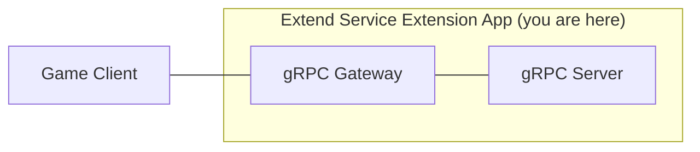

# extend-service-extension-csharp



`AccelByte Gaming Services` features can be extended by using 
`Extend Service Extension` apps. An `Extend Service Extension` app is essentially a 
custom REST API service. It is implemented using a combination of [gRPC Gateway and gRPC Server](https://github.com/grpc-ecosystem/grpc-gateway?tab=readme-ov-file#about).

## Overview

This repository contains a sample `Extend Service Extension` app written in 
`C#`. It provides a simple custom guild service that has two endpoints to 
create and get guild progress data.

This sample app also shows the instrumentation setup necessary for 
observability. It is required so that metrics, traces, and logs are able to 
flow properly when the app is deployed.


## Prerequisites


1. Windows 10 WSL2 or Linux Ubuntu 20.04 with the following tools installed.

   a. bash

   b. make

   c. [docker v23.x](https://docs.docker.com/engine/install/ubuntu/)

   d. .net 6 sdk

   e. go v1.20 (optional, the generate `grpc-gateway` step in the Makefile uses a docker image to compile)

2. Access to `AccelByte Gaming Services` environment.

   a. Base URL:

      - For `Starter` tier e.g.  https://spaceshooter.gamingservices.accelbyte.io
      - For `Premium` tier e.g.  https://dev.accelbyte.io

   b. [Create a Game Namespace](https://docs.accelbyte.io/gaming-services/tutorials/how-to/create-a-game-namespace/) if you don't have one yet. Keep the `Namespace ID`.


   c. [Create an OAuth Client](https://docs.accelbyte.io/gaming-services/services/access/authorization/manage-access-control-for-applications/#create-an-iam-client) with confidential client type with the following permissions. Keep the `Client ID` and `Client Secret`.
   
      - `ADMIN:ROLE [READ]` (required to be able to validate access token and permissions)
      - `ADMIN:NAMESPACE:{namespace}:CLOUDSAVE:RECORD [CREATE, READ, UPDATE, DELETE]` (required to be able to create, read, update, and delete cloudsave records)

## Setup

1. Create a docker compose `.env` file by copying the content of [.env.template](.env.template) file.

   > :warning: **The host OS environment variables have higher precedence compared to `.env` file variables**: If the variables in `.env` file do not seem to take effect properly, check if there are host OS environment variables with the same name. 
   See documentation about [docker compose environment variables precedence](https://docs.docker.com/compose/environment-variables/envvars-precedence/) for more details.

2. Fill in the required environment variables in `.env` file as shown below.

   ```
   AB_BASE_URL='http://test.accelbyte.io'    # Your environment's domain Base URL
   AB_CLIENT_ID='xxxxxxxxxx'                 # Client ID from the Prerequisites section
   AB_CLIENT_SECRET='xxxxxxxxxx'             # Client Secret from the Prerequisites section
   AB_NAMESPACE='xxxxxxxxxx'                 # Namespace ID from the Prerequisites section
   PLUGIN_GRPC_SERVER_AUTH_ENABLED=true      # Enable or disable access token and permission validation
   BASE_PATH='/guild'                        # The base path used for the app
   ```
 
   > :info: **In this sample app, PLUGIN_GRPC_SERVER_AUTH_ENABLED is `true` by default**: If it is set to `false`, the endpoint `permission.action` and `permission.resource`  validation will be disabled and the endpoint can be accessed without a valid access token. This option is provided for development purpose only. For more information, see [creating-new-endpoint](docs/6-creating-new-endpoint.md#6-creating-a-new-endpoint).
   
   For more options, create `src/AccelByte.PluginArch.ServiceExtension.Demo.Server/appsettings.Development.json` and fill in the required configuration.   
   ```json
   {
   "DirectLogToLoki": false,
   "EnableAuthorization": true,                 // Enable or disable access token and permission check (env var: PLUGIN_GRPC_SERVER_AUTH_ENABLED)
   "RevocationListRefreshPeriod": 60,
   "AccelByte": {
      "BaseUrl": "http://test.accelbyte.io",     // Your environment's domain Base URL (env var: AB_BASE_URL)
      "ClientId": "xxxxxxxxxx",                   // Client ID (env var: AB_CLIENT_ID)    
      "ClientSecret": "xxxxxxxxxx",               // Client Secret (env var: AB_CLIENT_SECRET)
      "AppName": "EXTENDSERVICEEXTENSIONSERVICE",
      "TraceIdVersion": "1",
      "Namespace": "xxxxxxxxxx",                  // Namespace ID (env var: AB_NAMESPACE)
      "EnableTraceId": true,
      "EnableUserAgentInfo": true,
      "ResourceName": "EXTENDSERVICEEXTENSIONSERVICE"
   }
   ```
   > :warning: **Environment variable values will override related configuration values in this file**.

## Building

To build this sample app, use the following command.

```shell
make build
```

The build output will be available in `.output` directory.

## Running

To (build and) run this sample app in a container, use the following command.

```shell
docker compose up --build
```

## Testing

### Unit Test

Unit test is provided to test the functionaly without actually invoking the grpc function. Unit test is provided in `src/AccelByte.PluginArch.ServiceExtension.Demo.Tests`. To run the test, you'll need to fill the env var file mentioned below,
```
AB_BASE_URL='http://test.accelbyte.io'       # Your environment's domain Base URL
AB_CLIENT_ID='xxxxxxxxxx'                    # Client ID from the Prerequisites section
AB_CLIENT_SECRET='xxxxxxxxxx'                # Client Secret from the Prerequisites section
AB_NAMESPACE='xxxxxxxxxx'                    # Namespace ID from the Prerequisites section
```
then run this command.

```shell
make test ENV_FILE_PATH=<your env var file>
```

### Test in Local Development Environment

The custom function in this sample app can be tested locally using Swagger UI.

1. If **PLUGIN_GRPC_SERVER_AUTH_ENABLED** is `true`, you'll need user's access token to access the REST API service. You can generate user's access token with [getusertoken.sh](getusertoken.sh) shell script.
   To run it, you'll need to set these environment variables:
   ```shell
   $ export AB_BASE_URL='http://test.accelbyte.io'    # Your environment's domain Base URL
   $ export AB_CLIENT_ID='xxxxxxxxxx'                 # Client ID from the Prerequisites section
   $ export AB_CLIENT_SECRET='xxxxxxxxxx'             # Client Secret from the Prerequisites section
   ```
   Then run the script:
   ```shell
   # <username> and <password> is user's credential to access AGS.
   $ ./getusertoken.sh <username> <password>
   ```

2. Run this `Extend Service Extension` sample app by using the command below.

   ```shell
   docker compose up --build
   ```

3. After the `gRPC Server` is confirmed working, the REST API service can be tested by opening Swagger UI at `http://localhost:8000/guild/apidocs/`. Use this to create an API request for testing.
   > :info: Depending on the envar you set for `BASE_PATH`, the service will have different service URL. This how it's the formatted `http://localhost:8000/<base_path>`

   > :info: **PLUGIN_GRPC_SERVER_AUTH_ENABLED**: If 'true', you'll need to authorize Swagger UI using user's access token. You can refer to first step above on how to generate user's access token. Make sure the user has a role contains following permission: `ADMIN:NAMESPACE:{namespace}:CLOUDSAVE:RECORD [CREATE, READ, UPDATE, DELETE]`.

   

   To authorize Swagger UI, click on "Authorize" button on right side.

   

   Popup will show, input "Bearer <user's access token>" in `Value` field for `Bearer (apiKey)`. Then click "Authorize" to save the user's access token.

### Test Observability

To be able to see the how the observability works in this sample app locally, there are few things that need be setup before performing tests.

1. Uncomment loki logging driver in [docker-compose.yaml](docker-compose.yaml)

   ```
    # logging:
    #   driver: loki
    #   options:
    #     loki-url: http://host.docker.internal:3100/loki/api/v1/push
    #     mode: non-blocking
    #     max-buffer-size: 4m
    #     loki-retries: "3"
   ```

   > :warning: **Make sure to install docker loki plugin beforehand**: Otherwise,
   this sample app will not be able to run. This is required so that container logs
   can flow to the `loki` service within `grpc-plugin-dependencies` stack. 
   Use this command to install docker loki plugin: `docker plugin install grafana/loki-docker-driver:latest --alias loki --grant-all-permissions`.

2. Clone and run [grpc-plugin-dependencies](https://github.com/AccelByte/grpc-plugin-dependencies) stack alongside this sample app. After this, Grafana 
will be accessible at http://localhost:3000.

   ```
   git clone https://github.com/AccelByte/grpc-plugin-dependencies.git
   cd grpc-plugin-dependencies
   docker compose up
   ```

   > :exclamation: More information about [grpc-plugin-dependencies](https://github.com/AccelByte/grpc-plugin-dependencies) is available [here](https://github.com/AccelByte/grpc-plugin-dependencies/blob/main/README.md).

3. Perform testing. For example, by following [Test in Local Development Environment](#test-in-local-development-environment).

## Deploying

After done testing, you may want to deploy this app to `AccelByte Gaming Services`.

1. [Create a new Extend Service Extension App on Admin Portal](https://docs.accelbyte.io/gaming-services/services/extend/service-extension/getting-started-service-extension/#register-and-integrate-custom-service-to-extend-service-extension). Keep the `Repository URI`.
2. Download and setup [extend-helper-cli](https://github.com/AccelByte/extend-helper-cli/) (only if it has not been done previously).
3. Perform docker login with `extend-helper-cli` using the following command.
   ```
   extend-helper-cli dockerlogin --namespace <my-game> --app <my-app> --login
   ```
   > :exclamation: For your convenience, the above `extend-helper-cli` command can also be 
   copied from `Repository Authentication Command` under the corresponding app detail page.
4. Build and push sample app docker image to AccelByte ECR using the following command.
   ```
   make imagex_push IMAGE_TAG=v0.0.1 REPO_URL=xxxxxxxxxx.dkr.ecr.us-west-2.amazonaws.com/accelbyte/justice/development/extend/xxxxxxxxxx/xxxxxxxxxx
   ```
   > :exclamation: **The REPO_URL is obtained from step 1**: It can be found under 'Repository URI' in the app detail.

## Additional

For more details on how to develop a custom service based on this sample app, please refer documentation [here](./docs/0-toc.md).

## Changelog & Update Notices

Ensure you're always up-to-date with the latest changes to our application. This section is dedicated to highlighting significant updates, including new features and breaking changes, to advise users on the importance of updating to the latest version.

### v2024.01 - (Release Date: 2024-01-01) [**BREAKING CHANGE**]

**Breaking Change & New Feature: `Dynamic Base Path`**

- We've introduced a **Dynamic Base Path** feature, enabling seamless deployment of the Service Extension into any namespace or environment without requiring image modifications. This significant enhancement offers flexibility and efficiency in how services are deployed.
- **Impact:** This change modifies the deployment and configuration process of the Service Extension. If your application utilized the Service Extension sample app before **February 26th, 2024**, updating is essential to maintain functionality and leverage this new capability.
- **Action Required:** Follow the [migration guide](./docs/migration-guide/migration-v2023.12-to-v2024.01.md) for comprehensive instructions on updating your Service Extension app to utilize the dynamic extension path. Updating ensures compatibility and allows you to benefit from enhanced deployment flexibility.

### v2023.12 - (Release Date: 2023-12-11)

**New Features:**
- Initial release
---
